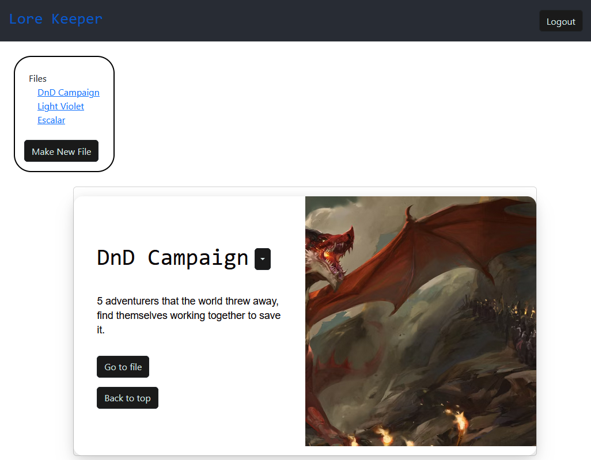
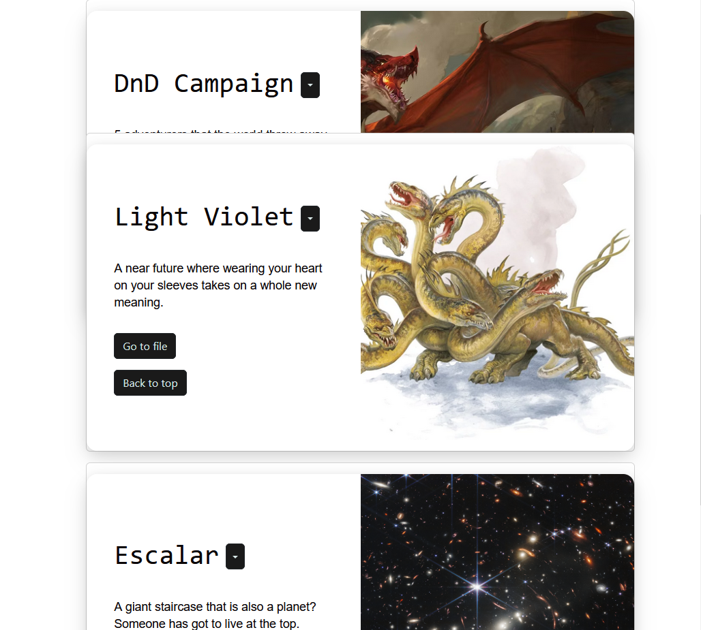
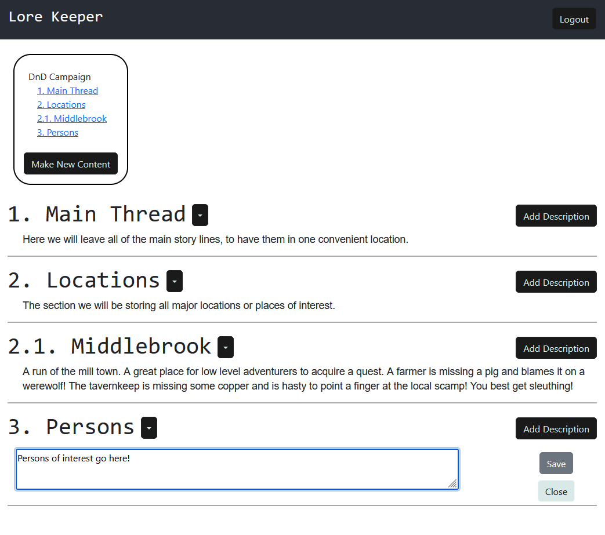

# Lore Keeper

<div id="top"></div>

[](https://opensource.org/licenses/MIT)

  <summary>Table of Contents</summary>
  <ol>
    <li>
      <a href="#about-the-project">About The Project</a>
      <ul>
        <li><a href="#built-with">Built With</a></li>
      </ul>
    </li>
    <li>
      <a href="#getting-started">Getting Started</a>
      <ul>
        <li><a href="#installation">Installation</a></li>
      </ul>
    </li>
    <li><a href="#usage">Usage</a></li>
    <li><a href="#contributing">Contributing</a></li>
    <li><a href="#contact">Contact</a></li>
    <li><a href="#acknowledgments">Acknowledgments</a></li>
  </ol>




<!-- ABOUT THE PROJECT -->
## About The Project

* Concept and Motivation: I love stories. I love watching them, reading, hearing, writing, imagining them. Lore Keeper was built with stories in mind. We are all natural story tellers, so it felt just as natural to provide a program to aid that in some way. Lore Keeper is intended to be used to help you keep track of any kind of expansive story (simple ones are welcome too!). The app keeps each story in its own 'file,' as I have been referring to them, and the user is able to break apart their story as they see fit in that file. The project is at its simplest, currently, with the ability to make, edit, and delete files, and make, edit, and delete content within those files. Even in its current state it can be leveraged as a powerful tool to aid in the telling of a story, with many more feautres on the horizon that will bring its capabilities to higher heights.  


<p align="right">(<a href="#top">back to top</a>)</p>



### Built With

* [React](https://reactjs.org/)
* [React Bootstrap](https://react-bootstrap.github.io/)
* [Node.js](https://nodejs.dev/)
* [Flask](https://flask.palletsprojects.com/en/2.2.x/)
* [SQL Alchemy](https://www.sqlalchemy.org/)


<p align="right">(<a href="#top">back to top</a>)</p>

<!-- GETTING STARTED -->
## Getting Started

To get a local copy up and running, follow these simple steps.


### Installation
If you wish to run this app locally on your machine, or tinker with the code yourself, follow these steps to get it up and running!

1. Have python installed (I believe it needs to be v3.5 or higher), Node.js and MySQL.  
2. Run ``` npm i ``` to install all necessary node packages.
3. cd into the server directory and run this command to create your virtual environment (mac users will want to enter python3 intsead of python)
```sh
  python -m venv env 
  ```
4. Enter your virtual environment by running the command:
```sh
# windows 
./env/Scripts/activate
# mac
./env/bin/activate
```
While in your virtual environment download all of the pip packages from the requirements.txt with:
```sh
pip install -r requirements.txt
```
5. Lastly, you will want to convert the .exampleENV file into a .env file, and populate it accordingly. You can now cd out of server to the root level of the project and start the app with ``` npm run develop ```.  

* Python download: [https://www.mongodb.com/](https://www.mongodb.com/)  
* Node.js download: [https://nodejs.org/en/download/](https://nodejs.org/en/download/)  
* MySQL download: [https://www.mysql.com/downloads/](https://www.mysql.com/downloads/)  


<!-- USAGE EXAMPLES -->
## Usage

1. Sign up and log into your Lore Keeper account.

2. Create a File.

3. Get to storytelling!


<p align="right">(<a href="#top">back to top</a>)</p>

<!-- ROADMAP -->
## Roadmap for future development

- Implement [Quill](https://quilljs.com/) for more customizable text. 
- Allow for collaboration on files to have multiple voices in one story.
- Want to work on your story else where? Working on allowing an export of a file as a download or sent to you via email.
- Tag content to other content to more directly link them.

<!-- See the [open issues](https://github.com/github_username/repo_name/issues) for a full list of proposed features (and known issues). -->

<p align="right">(<a href="#top">back to top</a>)</p>

<!-- CONTRIBUTING -->
<!-- ## Contributing

Contributions are what make the open source community such an amazing place to learn, inspire, and create. Any contributions you make are **greatly appreciated**.

If you have a suggestion that would make this better, please fork the repo and create a pull request. You can also simply open an issue with the tag "enhancement".
Don't forget to give the project a star! Thanks again!

1. Fork the Project
2. Create your Feature Branch (`git checkout -b feature/AmazingFeature`)
3. Commit your Changes (`git commit -m 'Add some AmazingFeature'`)
4. Push to the Branch (`git push origin feature/AmazingFeature`)
5. Open a Pull Request

<p align="right">(<a href="#top">back to top</a>)</p> -->


<!-- LICENSE -->
<!-- ## License

[](https://opensource.org/licenses/MIT) -->


<!-- <p align="right">(<a href="#top">back to top</a>)</p> -->


<!-- CONTACT -->
## Contact

Please feel free to email any suggestions!  
Email: dev.ben.christensen@gmail.com

Project Link: [https://github.com/b-e-christensen/lore-keeper-python](https://github.com/b-e-christensen/lore-keeper-python)

<p align="right">(<a href="#top">back to top</a>)</p>


<!-- ACKNOWLEDGMENTS -->
## Acknowledgments

* Thanks Codepen user [Bramus](https://codepen.io/bramus) for the **awesome** card layout of the home page. 

<p align="right">(<a href="#top">back to top</a>)</p>